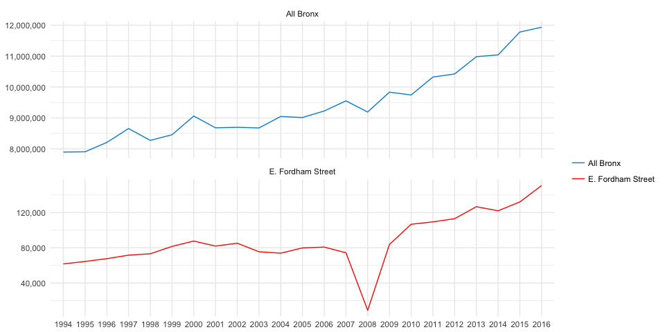

Retrieving Bank Locations and Deposits using Geo-spatial Filtering
================

Our objective is to retrieve all bank branches, and their associated deposits, along a given corridor in the Bronx. This script will demonstrate how to quickly define a geographic are-of-interest by hand-drawing and subsequently buffering a `linestring`.

We will be using the `sf` classes and methods in conjunction with `mapedit` to create custom shapefiles for rapid filtering and analysis.

``` r
# as of July 2017 I consider this is the modern geo-spatial R toolbox:
library(tidyverse)
library(sf)
library(mapedit)
library(mapview)
```

Load the FDIC data
==================

The data was downloaded from: [here](https://cdr.ffiec.gov/public/) and pre-processed lightly in R.

``` r
NYC_FDIC <- read_rds("data/NYC_FDIC_data_20170511.rds")
```

Pair down to just important variables and convert to an sf object:

``` r
nyc_fdic <- 
  NYC_FDIC %>% 
  select(year,uninumbr,namefull,addresbr,citybr,cntynamb
         ,stalpbr,zipbr,depsumbr,city2br,namebr,stnamebr
         ,"lat" = sims_latitude,"lon" = sims_longitude)

fdic_sf <-
  nyc_fdic %>% 
  mutate(lat = as.numeric(lat), lon = as.numeric(lon)) %>% 
  filter(!is.na(lat)) %>% 
  st_as_sf(coords = c("lon","lat"), crs = 4326, na.fail = F)
```

View all banks in the Bronx
===========================

``` r
#filter for just a handful of banks, since leaflet can't handle north of 100,000 points
bronx_banks <-
  fdic_sf %>% 
  filter(year==2016) %>% 
  filter(cntynamb=="Bronx") %>% 
  filter(stnamebr=="New York") 

nrow(fdic_sf)
```

    ## [1] 134521

``` r
nrow(bronx_banks)
```

    ## [1] 149

Visualize with leaflet.js
=========================

``` r
bronx_banks %>% 
  leaflet() %>% 
  addTiles() %>% 
  addMarkers(popup = ~addresbr)
```


Using MapEdit to draw a line
============================

The following code snippet will launch an interactive session where you can draw polygons, points or lines on a map of your making. Once you click 'Done', the session returns a list containing several `sf` objects.

After drawing the line, it is best to cache the object.

``` r
# manually select the corridor with editmap
# (Not run)
e_fordham_road_shapefile<-
  bronx_banks %>%
  leaflet() %>%
  addTiles() %>%
  addMarkers() %>%
  editMap()

# extract the line
e_fordham_road_sf <- e_fordham_road_shapefile$finished

# write to a GEOjson file
st_write(e_fordham_road_sf, "data/e_fordham_road_linestring.geojson",driver="GEOjson", delete_dsn = T)
```

Loading the cached file
=======================

``` r
e_fordham_road_sf <- st_read("data/e_fordham_road_linestring.geojson")
```

    ## converted into: LINESTRING
    ## Simple feature collection with 1 feature and 2 fields
    ## geometry type:  LINESTRING
    ## dimension:      XY
    ## bbox:           xmin: -73.897 ymin: 40.8617 xmax: -73.8914 ymax: 40.8625
    ## epsg (SRID):    4326
    ## proj4string:    +proj=longlat +datum=WGS84 +no_defs

show the line
=============

``` r
e_fordham_road_sf %>% 
  leaflet() %>% 
  addTiles() %>% 
  addPolylines()
```


Add a buffer to the line
========================

We first have to convert to UTM coordinates, perform the operation, the convert back to lat/lon

``` r
e_fordham_buffer<- 
  e_fordham_road_sf %>% 
  st_transform(crs = 32618) %>% 
  st_buffer(25) %>% 
  st_transform(crs = 4326) 

# for leafelt::setView() in the next step
set_view_coords <- 
e_fordham_buffer$geometry %>% 
  st_transform(4326) %>%
  st_centroid() %>% 
  st_coordinates() %>% 
  as_data_frame()
```

    ## Warning in st_centroid.sfc(.): st_centroid does not give correct centroids
    ## for longitude/latitude data

The Corridor:
=============

``` r
e_fordham_buffer %>% 
  st_transform(4326) %>%
  leaflet() %>% 
  addTiles() %>% 
  setView(lng = set_view_coords$X, lat = set_view_coords$Y, zoom = 16) %>% 
  addPolylines(data=e_fordham_road_sf, color="green") %>% 
  addPolygons() %>% 
  addMarkers(data = bronx_banks)
```


Geo-filtering using point-in-polygon
====================================

Now that we have our buffered line in the form of a Multipolygon, we can go back and filter the original data set of bank locations.

``` r
# filter for banks from the original dataset
contain_vec <- st_contains(e_fordham_buffer,fdic_sf)[[1]]
```

    ## although coordinates are longitude/latitude, it is assumed that they are planar

Finishing up, aggregating the deposit amount vs the borough at large
====================================================================

``` r
# convert dollar character to numeric
fix_dollar <- function(x) as.numeric(stringr::str_replace(x,"$|,",""))

# filter for banks inside the buffer area with row_number() and the logical vector
fordham_street <-
fdic_sf %>% 
  filter(row_number()%in%contain_vec) %>% 
  st_set_geometry(NULL) %>% 
  group_by(year) %>% 
  summarise(Fordham_Deposits = sum(fix_dollar(depsumbr),na.rm=T))

# compare to all of the bronx
all_bronx <- 
fdic_sf %>% 
  filter(cntynamb=="Bronx") %>% 
  filter(stnamebr=="New York") %>% 
  st_set_geometry(NULL) %>% 
  group_by(year) %>% 
  summarise(Bronx_Deposits = sum(fix_dollar(depsumbr),na.rm=T))

# combine and compare
compare_deposits <- left_join(fordham_street,all_bronx, by = "year")

compare_deposits %>% 
  rename("All Bronx" = Bronx_Deposits, "E. Fordham Street" = Fordham_Deposits) %>% 
  gather(Var, Value, -year) %>% 
  ggplot()+
  aes(x = year, y = Value, group = Var, color = Var, fill = Var)+
  geom_line()+
  facet_wrap(~Var, ncol = 1, scales = "free_y")+
  theme_minimal()+
  ggthemes::scale_color_fivethirtyeight()+
  scale_y_continuous(labels = scales::comma)+
  labs(col=NULL
       , y = NULL
       , x = NULL)
```



And percent change:

``` r
percent_change <-
  compare_deposits %>% 
  filter(year%in%c(min(year),max(year))) %>% 
  mutate_if(.predicate=is.numeric,.funs = function(x) x = scales::percent((x - lag(x,1))/lag(x,1))) %>% 
  filter(year==max(year))

knitr::kable(percent_change)
```

| year | Fordham\_Deposits | Bronx\_Deposits |
|:-----|:------------------|:----------------|
| 2016 | 144%              | 51.2%           |

This is a simple technique for quickly hand-drawing and caching shapefile, then using that shapefile to filter a geo-located data set.
